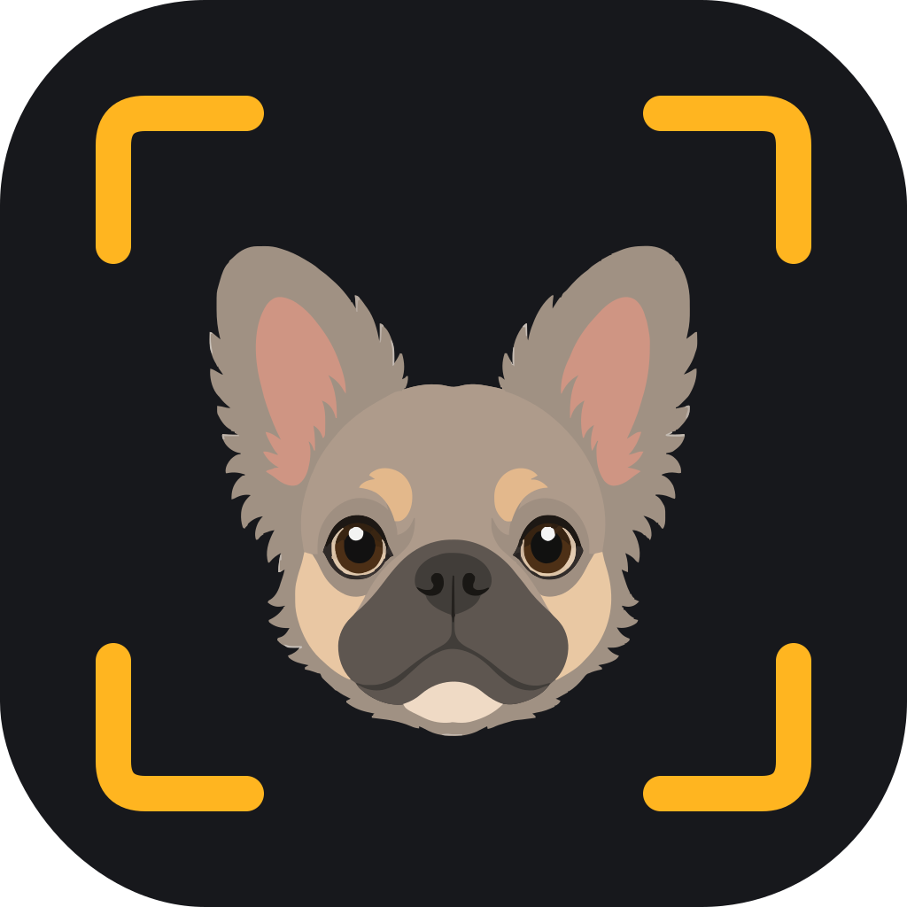

<p align="center">
  
</p>

<h1 align="center">lilshot</h1>

<p align="center">Tiny, native, open-source screenshots for macOS — pick any window on any Space and capture it without ever bringing it forward.</p>

## Why lilshot

Every screenshot tool makes you *find* the window first. lilshot doesn't: press a hotkey, fuzzy-type the app or window title, see a live preview, hit Enter. The window can be occluded, minimized, or sitting on another desktop — you never leave where you are.

- **Window picker** (⌥⇧S) — fuzzy search across every window on every Space, large live preview, Enter captures to clipboard
- **Re-capture last** (⌥⇧R) — the same window again, one keystroke, no picker
- **Region** (⌥⇧A), **region OCR** (⌥⇧O), and **fullscreen** (⌥⇧F) — with native-scale capture and feedback
- **Built-in editor** — Shottr-style: arrow, rectangle, step numbers, text, pixelate-blur, crop, and Copy text (⌘⇧T); the original hits your clipboard instantly, annotations replace it on Cmd+C
- **Agent-friendly CLI** — `lilshot list --json`, `lilshot capture <query>`, and `lilshot ocr <query>`; clean stdout for agents
- Native pixel scale on every display (1x ultrawides and retina both come out exactly right)

## Install

Build from source (macOS 14+, Xcode command line tools):

```bash
git clone https://github.com/lieugroup/lilshot.git
cd lilshot
bash scripts/make-app.sh
open dist/lilshot.app
```

Grant Screen Recording permission on first capture. Homebrew cask coming with the first tagged release. Signed and notarized zips (built via `scripts/make-release.sh` with `LILSHOT_SIGN_IDENTITY` / `LILSHOT_NOTARY_*` env vars) will be attached to GitHub Releases.

## CLI

```bash
swift build -c release
./.build/release/lilshot list --json     # every window, JSON for scripts/agents
./.build/release/lilshot capture chrome  # fuzzy match → PNG
./.build/release/lilshot capture 51 -o shot.png
./.build/release/lilshot ocr chrome      # fuzzy match → text on stdout
./.build/release/lilshot ocr 51
```

## Development

```bash
swift test            # 127 tests, core logic is TDD'd
swift run LilshotApp  # run the menu bar app without bundling
```

Architecture: `LilshotCore` (pure logic, fully tested) · `LilshotMac` (thin ScreenCaptureKit adapters) · `LilshotApp` (menu bar UI) · `lilshot` (CLI). See `plans/` for milestone history and `spikes/` for the ScreenCaptureKit findings that shaped the design.

## About the name

lilshot is part of [lieugroup](https://github.com/lieugroup) — a family of small, focused macOS tools supervised by Lil Lil, a fluffy French Bulldog. She appears in the app icon.

MIT licensed.
